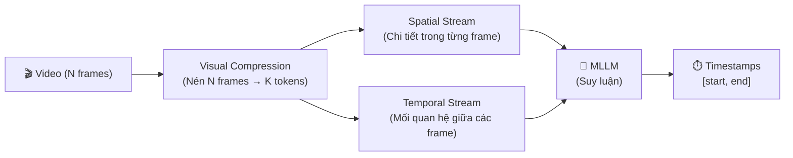
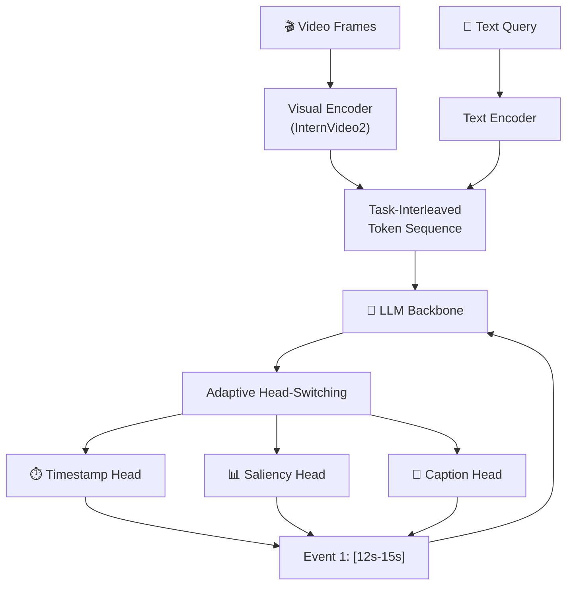
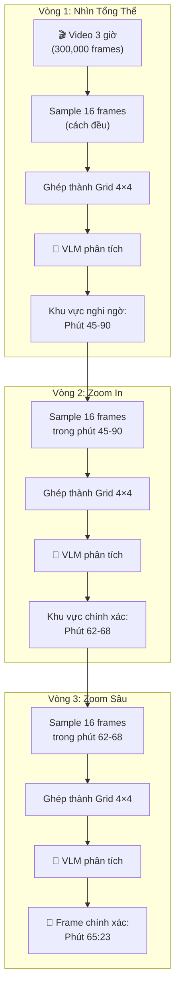
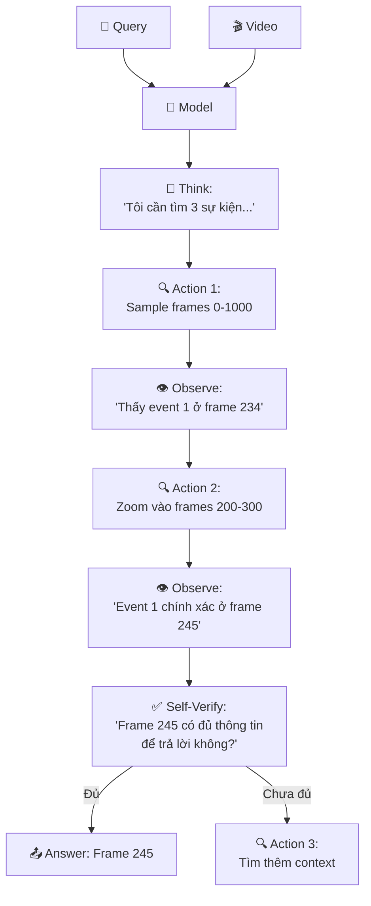
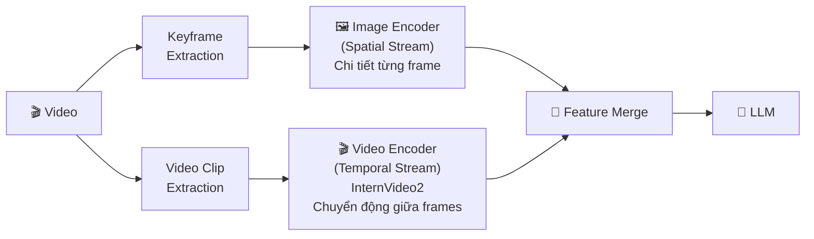

# 📖 6 Hướng Nghiên Cứu Mới Nhất Về Temporal Video Retrieval (2025–2026)

> Tài liệu chi tiết cho bạn hiểu trước khi bắt tay vào xây dựng hệ thống AIC 2026.
> Mỗi hướng sẽ được giải thích theo format: **Bài toán → Ý tưởng → Cách hoạt động → Ứng dụng cho AIC**.

---

## Hướng 1: MLLM-Driven Temporal Grounding (Dùng LLM đa phương thức để định vị thời gian)

### 📄 Paper
- **Tên**: *"A Survey on Video Temporal Grounding with Multimodal Large Language Model"*
- **arXiv**: [2508.10922](https://arxiv.org/abs/2508.10922) (Tháng 8/2025)
- **Loại**: Survey (tổng hợp toàn bộ nghiên cứu trong lĩnh vực)
- **GitHub**: [Awesome-MLLMs-for-Video-Temporal-Grounding](https://github.com/ki-lw/Awesome-MLLMs-for-Video-Temporal-Grounding)

### 🎯 Bài toán giải quyết
Trước đây, để tìm một khoảnh khắc trong video (Temporal Grounding), người ta dùng CLIP hoặc BEiT3 — những mô hình "đóng băng" (frozen), chỉ biết **so khớp vector** giữa text và hình ảnh. Chúng hoạt động nhanh nhưng **không biết suy luận**.

Ví dụ, nếu query là: *"Tìm khoảnh khắc SAU KHI người đàn ông đặt ly xuống bàn, anh ta quay lại nhìn camera"* — CLIP sẽ chỉ tìm "người đàn ông nhìn camera" mà **bỏ qua hoàn toàn điều kiện thời gian "SAU KHI đặt ly xuống bàn"**.

### 💡 Ý tưởng cốt lõi
Thay vì dùng mô hình "đóng băng", dùng **Multimodal LLM** (GPT-4o, Gemini, LLaVA) — những mô hình có khả năng **đọc hiểu, suy luận logic, và hiểu thứ tự thời gian** — để trực tiếp phân tích video và trả lời "khoảnh khắc đó xảy ra ở giây thứ bao nhiêu?"

### 🏗️ Phân loại (Taxonomy) theo Survey

Survey chia các phương pháp MLLM-VTG thành **3 chiều (dimension)**:

#### Chiều 1: Vai trò của MLLM

| Vai trò | Cách hoạt động | Ví dụ |
|---------|---------------|-------|
| **Facilitator (Hỗ trợ)** | MLLM không trực tiếp tìm kiếm. Nó chỉ tạo ra mô tả văn bản (caption) cho từng đoạn video, rồi đưa caption đó cho module tìm kiếm truyền thống (CLIP) xử lý. | Dùng Gemini để viết caption cho 100 keyframes → Tìm kiếm bằng text matching trên caption |
| **Executor (Thực thi)** | MLLM trực tiếp nhận video + query → Xuất ra timestamp `[start, end]`. Không cần module tìm kiếm riêng. | Nhập video + query "người đàn ông nhìn camera" → MLLM trả lời "từ giây 45 đến giây 48" |

#### Chiều 2: Cách huấn luyện (Training Paradigm)

| Paradigm | Mô tả | Ưu / Nhược |
|----------|-------|-------------|
| **Pretraining** | Huấn luyện trên dữ liệu video khổng lồ để MLLM hiểu "thời gian là gì" | ✅ Tổng quát, ❌ Tốn tài nguyên cực lớn |
| **Fine-tuning** | Lấy MLLM có sẵn (GPT-4o) → Tinh chỉnh trên dữ liệu VTG cụ thể | ✅ Chính xác cao, ❌ Cần dữ liệu label |
| **Training-free** | Dùng MLLM "nguyên xi" (zero-shot), không huấn luyện thêm gì cả | ✅ Nhanh, dễ dùng, ❌ Kém chính xác hơn |

#### Chiều 3: Cách xử lý Video Features



- **Explicit Temporal Modeling**: Thêm các "temporal token" đặc biệt (ví dụ: `<TIME_00:45>`) vào vocabulary của LLM để nó biết biểu diễn thời gian.
- **Implicit Temporal Modeling**: Dùng Rotary Position Embedding (RoPE) để LLM tự ngầm hiểu thứ tự thời gian qua vị trí của token.

### 🔧 Ứng dụng cho AIC 2026

| Ứng dụng | Vai trò MLLM | Giai đoạn |
|----------|-------------|-----------|
| **Caption generation** | Facilitator | Indexing (tiền xử lý) |
| **Query understanding** | Executor | Retrieval (lúc thi) |
| **Reranking** | Executor | Reranking (sau khi có Top-K) |
| **VQA answering** | Executor | Trả lời câu hỏi |

> [!TIP]
> **Cho AIC 2026**: Dùng MLLM ở vai trò **Facilitator** (tạo caption cho keyframes trước khi thi) là khả thi nhất. Dùng ở vai trò **Executor** (chạy real-time lúc thi) thì chỉ nên áp dụng cho bước Reranking (Top-10 cuối cùng) vì rất chậm.

---

## Hướng 2: OMTG — One-to-Many Temporal Grounding (Một Query → Nhiều Đoạn Video)

### 📄 Paper
- **Tên**: *"Towards One-to-Many Temporal Grounding"*
- **Venue**: ICML 2026
- **Dataset**: OMTG-56K (46K SFT + 10K RL samples)
- **Benchmark**: OMTG Bench (340 mẫu, 2–20 segments/query)

### 🎯 Bài toán giải quyết
Hầu hết các mô hình Temporal Grounding hiện tại đều giả định: **1 query → 1 đoạn video duy nhất**. Nhưng thực tế thì sao?

Ví dụ, query: *"Tìm tất cả những lần thủ môn bắt bóng"* trong một trận bóng đá 90 phút — có thể có **15 lần bắt bóng** rải rác khắp video! Các mô hình cũ chỉ trả về 1 lần duy nhất rồi dừng.

### 💡 Ý tưởng cốt lõi

```
Mô hình cũ (One-to-One):
Query "thủ môn bắt bóng" → [15:32 - 15:35] (chỉ 1 đoạn)

Mô hình OMTG (One-to-Many):
Query "thủ môn bắt bóng" → [15:32-15:35], [23:10-23:12], [31:45-31:48], ... (tất cả 15 đoạn)
```

### 🏗️ Cách hoạt động

#### Bước 1: Huấn luyện SFT (Supervised Fine-Tuning)
- Dùng 46K mẫu từ OMTG-56K để dạy MLLM biết cách trả về **nhiều đoạn** thay vì 1 đoạn.
- Format output: `<time_start_1> <time_end_1> <time_start_2> <time_end_2> ...`

#### Bước 2: Huấn luyện RL (Reinforcement Learning)
- Dùng 10K mẫu với 2 hàm reward đặc biệt:
  - **Temporal Reward**: Thưởng khi model tìm đúng timestamp.
  - **Caption Reward**: Dùng Chain-of-Thought reasoning trên dense video captions để xác minh xem đoạn tìm được có đúng nội dung không.

#### Metrics mới

| Metric | Đo lường gì | Ví dụ |
|--------|------------|-------|
| **Count Accuracy (C-Acc)** | Model có đếm đúng số lượng sự kiện không? | Đáp án: 5 lần bắt bóng. Model trả về 5 → C-Acc = 100% |
| **Effective Temporal F1 (EtF1)** | Vừa đếm đúng, VỪA định vị đúng | Đếm đúng 5 lần + tìm đúng vị trí cả 5 → EtF1 cao |

### 🔧 Ứng dụng cho AIC 2026 (TRAKE)
TRAKE yêu cầu tìm **N sự kiện** trong video — bản chất đây chính là bài toán One-to-Many! Tuy nhiên, TRAKE còn yêu cầu thêm **thứ tự thời gian** (event 1 phải trước event 2), nên cần kết hợp OMTG với thuật toán DANTE (Dynamic Programming) để đảm bảo tính đơn điệu.

> [!IMPORTANT]
> **Liên hệ TRAKE**: OMTG giải quyết việc "tìm nhiều đoạn" nhưng không quan tâm thứ tự. TRAKE cần cả hai: tìm nhiều đoạn + đúng thứ tự. Nên OMTG là nền tảng, DANTE là phần bổ sung.

---

## Hướng 3: TRACE — Causal Event Modeling cho Video LLM

### 📄 Paper
- **Tên**: *"TRACE: Temporal Grounding Video LLM via Causal Event Modeling"*
- **Venue**: ICLR 2025 (hội nghị top-tier)
- **GitHub**: [gyxxyg/TRACE](https://github.com/gyxxyg/TRACE)
- **Checkpoints**: Có sẵn trên HuggingFace

### 🎯 Bài toán giải quyết
Các Video LLM hiện tại (LLaVA-Video, Video-LLaMA) khi được hỏi "Sự kiện X xảy ra lúc nào?" thường trả lời **lung tung** vì chúng được huấn luyện để **sinh text** (giống ChatGPT), chứ không được huấn luyện để **hiểu cấu trúc thời gian** của video.

Ví dụ, hỏi: "Người đàn ông đi vào phòng lúc nào?" → Video LLM có thể trả lời: "Khoảng giữa video" (rất mơ hồ) thay vì "Giây thứ 142 đến 147" (chính xác).

### 💡 Ý tưởng cốt lõi: Mô hình hóa video như chuỗi sự kiện nhân quả

Thay vì coi video là một "dòng pixel liên tục", TRACE coi video là một **chuỗi các sự kiện rời rạc**, mỗi sự kiện có 3 thành phần:

```
Event = {
    Timestamps:    [142s, 147s]           # Khi nào xảy ra
    Salient Score: 0.85                    # Quan trọng cỡ nào (0-1)  
    Caption:       "Người đàn ông đi vào"  # Mô tả bằng lời
}
```

Và các sự kiện được sắp xếp theo **chuỗi nhân quả** (causal chain):

```
Event 1 → Event 2 → Event 3 → ...
(đi vào)   (nhìn quanh)  (ngồi xuống)
```

Model dự đoán sự kiện hiện tại dựa trên: **sự kiện trước + video + text instruction**.

### 🏗️ Kiến trúc Task-Interleaved



**Giải thích Adaptive Head-Switching:**
- LLM có **3 đầu ra khác nhau** (head) cho 3 loại thông tin: timestamp, saliency score, caption.
- Khi sinh output, model tự động chuyển đổi giữa 3 head tùy theo token trước đó.
- Ví dụ: Sau khi sinh xong timestamp `[142s, 147s]`, model tự biết chuyển sang Saliency Head để sinh `0.85`, rồi chuyển sang Caption Head để sinh `"Người đàn ông đi vào"`.

### 📊 Kết quả
TRACE đạt SOTA trên nhiều benchmark:
- **Dense Video Captioning** (sinh caption cho toàn bộ video)
- **Moment Retrieval** (tìm khoảnh khắc cụ thể)
- **Video Highlight Detection** (phát hiện đoạn nổi bật)

### 🔧 Ứng dụng cho AIC 2026
- Dùng TRACE để **tiền xử lý** (Indexing): Chạy TRACE trên toàn bộ video → Sinh ra danh sách sự kiện (events) kèm timestamp → Lưu vào database.
- Khi thi, chỉ cần **so khớp text query với caption** của các events (rất nhanh) thay vì phải chạy MLLM real-time.

> [!TIP]
> TRACE rất phù hợp cho bước **Indexing** của TRAKE: chạy trước để tạo "bản đồ sự kiện" cho mỗi video, khi thi chỉ cần tra bản đồ.

---

## Hướng 4: T* (T-star) — Adaptive Temporal Zooming

### 📄 Paper
- **Tên**: *"Re-thinking Temporal Search for Long-Form Video Understanding"*
- **Venue**: CVPR 2025
- **Benchmark mới**: LV-Haystack (480 giờ video, 15,000 QA pairs)

### 🎯 Bài toán giải quyết: "Mò kim đáy bể" (Long Video Haystack)
Bạn có một video dài **3 giờ** (≈ 300,000 frames). Bạn cần tìm **đúng 3 frames** chứa khoảnh khắc cần tìm. Tỷ lệ: 3/300,000 = 0.001%.

Nếu dùng MLLM để xem từng frame → Phải xem 300,000 frames → Tốn hàng giờ đồng hồ.
Nếu sample đều (lấy mỗi 100 frames một) → Có thể bỏ lỡ khoảnh khắc quan trọng.

### 💡 Ý tưởng cốt lõi: "Zoom In" giống Google Maps

Khi bạn tìm một quán ăn trên Google Maps, bạn không mở bản đồ lên xem từng mét vuông của cả thành phố. Bạn:
1. Nhìn tổng thể cả thành phố → Xác định khu vực nghi ngờ (quận 1)
2. Zoom vào quận 1 → Xác định đường phố (Nguyễn Huệ)
3. Zoom vào đường Nguyễn Huệ → Tìm đúng quán ăn

T* làm y hệt nhưng trên **trục thời gian** của video:

### 🏗️ Cách hoạt động (3 vòng lặp)



**Chi tiết kỹ thuật:**
- Ở mỗi vòng, T* sample **16 frames** và ghép chúng thành **một bức ảnh grid 4×4**.
- Bức ảnh grid này được đưa cho VLM (GPT-4o, LLaVA) để hỏi: "Frame nào trong grid chứa sự kiện X?"
- VLM trả lời vị trí trên grid → T* biết cần zoom vào khoảng thời gian nào.
- Lặp lại 2-3 vòng là tìm được frame chính xác.

**Ưu điểm**: Chỉ cần **48 frames** (16 × 3 vòng) thay vì 300,000 frames → Nhanh gấp **6,250 lần**!

### 📊 Kết quả
- Kết hợp với GPT-4o: Cải thiện **đáng kể** trên LongVideoBench XL (video dài > 1 giờ).
- Kết hợp với LLaVA-OneVision-72B: Cải thiện tương tự mà chạy local được (không cần API).

### 🔧 Ứng dụng cho AIC 2026

> [!IMPORTANT]
> T* cực kỳ phù hợp cho TRAKE! Khi bạn đã tìm được video ứng viên (qua CLIP/Faiss), thay vì duyệt toàn bộ keyframes trong video đó, dùng T* để "zoom in" nhanh vào khu vực chứa sự kiện.

```python
# Ứng dụng T* cho TRAKE
def trake_with_tstar(video, events):
    results = []
    for event in events:
        # Dùng T* để zoom in tìm frame cho từng event
        frame = tstar_search(video, event.description, num_rounds=3)
        results.append(frame)
    return results
```

---

## Hướng 5: TimeSearch-R — Reinforcement Learning cho Temporal Retrieval

### 📄 Paper
- **Tên**: *"TimeSearch-R: Adaptive Temporal Search for Long-Form Video Understanding via Self-Verification Reinforcement Learning"*
- **Venue**: ICLR 2026
- **GitHub**: [Time-Search/TimeSearch-R](https://github.com/Time-Search/TimeSearch-R)

### 🎯 Bài toán giải quyết
T* (ở trên) tuy hiệu quả nhưng có một nhược điểm: **chiến lược zoom-in được thiết kế thủ công** (luôn chia đều, luôn 3 vòng). Nếu sự kiện nằm ở đầu video, tại sao phải zoom 3 lần? Nếu sự kiện rất khó tìm, 3 lần có đủ không?

TimeSearch-R giải quyết bằng cách: **Để AI tự học chiến lược tìm kiếm tối ưu** thông qua Reinforcement Learning (Học tăng cường).

### 💡 Ý tưởng cốt lõi: AI tự học cách tìm kiếm

Thay vì con người quy định: "Zoom 3 lần, mỗi lần 16 frames", TimeSearch-R huấn luyện AI bằng RL để nó tự quyết định:
- **Nên nhìn bao nhiêu frames?** (Đôi khi 8 frames là đủ, đôi khi cần 32)
- **Nên zoom vào đâu?** (Không nhất thiết phải zoom đều, có thể zoom lệch sang trái/phải)
- **Nên dừng lúc nào?** (Khi nào đã đủ tự tin về kết quả)

### 🏗️ Kiến trúc GRPO-CSV

**GRPO** = Group Relative Policy Optimization (một dạng RL hiện đại, tương tự PPO nhưng cho LLM)
**CSV** = Completeness Self-Verification (Tự xác minh tính đầy đủ)



**Giải thích Self-Verification (CSV):**
Đây là điểm khác biệt lớn nhất của TimeSearch-R. Sau mỗi lần "tìm kiếm", model tự hỏi chính mình:
- *"Những frames tôi vừa tìm được có ĐỦ thông tin để trả lời query không?"*
- Nếu CÓ → Dừng tìm, đưa ra câu trả lời.
- Nếu KHÔNG → Tiếp tục tìm thêm frames ở vùng khác.

Cơ chế này giúp model:
1. **Không tìm thiếu** (undershoot): Nếu chưa đủ, nó sẽ tìm thêm.
2. **Không tìm dư** (overshoot): Nếu đã đủ, nó sẽ dừng sớm, tiết kiệm thời gian.

### 📊 Kết quả
- **LongVideoBench**: +4.1% so với Qwen2.5-VL (base model), +2.0% so với Video-R1
- **Haystack-LVBench, Haystack-Ego4D**: Cải thiện đáng kể trên video cực dài
- **VideoMME, MLVU**: Cải thiện trên benchmark tổng hợp

### 🔧 Ứng dụng cho AIC 2026

> [!WARNING]
> TimeSearch-R đòi hỏi huấn luyện RL (rất tốn GPU và thời gian). Đối với đội thi sinh viên, nên **tham khảo ý tưởng** (interleaved reasoning + self-verification) thay vì reproduce toàn bộ model.

Cách áp dụng thực tế: Viết một **Agent** (dùng GPT-4o/Gemini API) mô phỏng hành vi của TimeSearch-R:
```python
def timesearch_agent(video_keyframes, query, max_rounds=5):
    context = []
    for round in range(max_rounds):
        # Agent quyết định sample frames nào
        frames_to_examine = agent_decide_frames(query, context)
        
        # Agent quan sát frames
        observations = vlm_observe(frames_to_examine)
        context.append(observations)
        
        # Agent tự xác minh
        is_sufficient = agent_self_verify(query, context)
        if is_sufficient:
            return agent_extract_answer(context)
    
    return agent_best_guess(context)
```

---

## Hướng 6: Grounded-VideoLLM — Fine-Grained Temporal Alignment

### 📄 Paper
- **Tên**: *"Grounded-VideoLLM: Grounded Video Large Language Model"*
- **Venue**: EMNLP 2025 (Findings)
- **GitHub**: Có sẵn, kèm model trên HuggingFace
- **Kiến trúc cơ sở**: Phi-3.5-Vision hoặc LLaVA-Next

### 🎯 Bài toán giải quyết
Các Video LLM hiện tại có 2 vấn đề lớn khi cần **căn chỉnh thời gian chính xác**:
1. **Kém về temporal modeling**: Chúng xử lý video như một "túi hình ảnh" (bag of images) — thấy 16 frames nhưng không biết frame nào trước, frame nào sau.
2. **Kém về timestamp representation**: Khi cần trả lời "giây thứ 142", chúng phải "viết chữ" con số 142 — nhưng LLM được huấn luyện để viết ngôn ngữ tự nhiên, không phải số liệu thời gian.

### 💡 Ý tưởng cốt lõi: Two-Stream + Discrete Temporal Tokens

#### A. Two-Stream Encoder (Bộ mã hóa hai luồng)



- **Spatial Stream** (Luồng không gian): Dùng Image Encoder (ViT) để phân tích **chi tiết bên trong** mỗi frame (màu sắc, vật thể, chữ viết...).
- **Temporal Stream** (Luồng thời gian): Dùng Video Encoder (InternVideo2) để phân tích **chuyển động giữa** các frames (ai đang đi, cái gì đang chuyển động...).
- Hai luồng được **merge** lại trước khi đưa vào LLM, giúp LLM vừa hiểu "có gì trong frame" vừa hiểu "frame này liên quan gì với frame trước/sau".

#### B. Discrete Temporal Tokens (Token thời gian rời rạc)

Thay vì bắt LLM "viết chữ" con số thời gian (dễ sai), Grounded-VideoLLM **thêm token đặc biệt** vào vocabulary:

```
Vocabulary cũ: ["the", "cat", "is", "sitting", ...]
Vocabulary mới: ["the", "cat", ..., "<t_0>", "<t_1>", "<t_2>", ..., "<t_999>"]
```

- `<t_0>` = giây thứ 0 của video
- `<t_142>` = giây thứ 142
- `<t_999>` = cuối video

Mỗi token `<t_i>` được gắn thêm **time knowledge embedding** (kiến thức về thời gian), giúp LLM hiểu rằng `<t_142>` gần `<t_143>` nhưng xa `<t_500>`.

### 🏗️ Multi-Stage Training (Huấn luyện đa giai đoạn)

```
Giai đoạn 1: Video Captioning (Dễ)
  → Dạy model biết "nhìn" video và mô tả
  
Giai đoạn 2: Temporal Grounding (Trung bình)  
  → Dạy model biết trả lời "sự kiện X xảy ra ở giây nào?"
  
Giai đoạn 3: Grounded VideoQA (Khó)
  → Dạy model vừa tìm khoảnh khắc, vừa trả lời câu hỏi về khoảnh khắc đó
```

Cách huấn luyện "từ dễ đến khó" này giúp model:
- Không bị "quên" kiến thức cũ khi học kiến thức mới (catastrophic forgetting).
- Xây dựng nền tảng vững chắc trước khi giải bài toán phức tạp.

### 📊 Kết quả
SOTA trên:
- **Temporal Sentence Grounding**: Tìm đoạn video khớp với mô tả text
- **Dense Video Captioning**: Tạo caption + timestamp cho mọi sự kiện
- **Grounded VideoQA**: Trả lời câu hỏi kèm bằng chứng thời gian

### 🔧 Ứng dụng cho AIC 2026

Grounded-VideoLLM phù hợp nhất cho 2 vai trò:

| Vai trò | Cách dùng |
|---------|-----------|
| **Reranker** | Sau khi CLIP/Faiss trả về Top-50, dùng Grounded-VideoLLM để chấm lại điểm từng kết quả. Nó sẽ hiểu ngữ cảnh thời gian tốt hơn CLIP rất nhiều. |
| **VQA Solver** | Dạng bài Q&A của AIC yêu cầu vừa tìm frame vừa trả lời câu hỏi → Grounded-VideoLLM sinh ra để làm việc này. |

> [!TIP]
> Grounded-VideoLLM chạy được trên **1 GPU T4** (Colab free) với phiên bản Phi-3.5-Vision (nhỏ). Đây là lựa chọn thực tế nhất cho sinh viên.

---

## 📊 BẢNG SO SÁNH TỔNG HỢP

| Hướng | Venue | Bài toán chính | Ưu điểm | Nhược điểm | Khả thi cho AIC 2026 |
|-------|-------|---------------|---------|-----------|---------------------|
| **MLLM-Driven** | Survey 2025 | Temporal Grounding tổng quát | Hiểu ngữ cảnh sâu | Chậm, tốn tài nguyên | ⭐⭐⭐ (dùng làm Facilitator) |
| **OMTG** | ICML 2026 | Tìm nhiều đoạn video | Metrics mới, benchmark chuẩn | Cần huấn luyện RL | ⭐⭐ (tham khảo metrics) |
| **TRACE** | ICLR 2025 | Sinh sự kiện + timestamp | Cấu trúc rõ ràng, code sẵn | Cần GPU mạnh để chạy | ⭐⭐⭐⭐ (dùng cho Indexing) |
| **T\*** | CVPR 2025 | Tìm frame trong video dài | Cực nhanh, dễ implement | Chiến lược cố định | ⭐⭐⭐⭐⭐ (dùng cho Search) |
| **TimeSearch-R** | ICLR 2026 | Tìm frame thông minh (RL) | Tự học chiến lược tối ưu | Cần huấn luyện RL phức tạp | ⭐⭐ (tham khảo ý tưởng) |
| **Grounded-VideoLLM** | EMNLP 2025 | Temporal alignment chính xác | SOTA, chạy được trên T4 | Chậm hơn CLIP | ⭐⭐⭐⭐ (dùng cho Reranking) |

---

## 🗺️ LỘ TRÌNH ƯU TIÊN CHO ĐỘI THI AIC 2026

| Ưu tiên | Hướng | Lý do |
|---------|-------|-------|
| 🥇 **1** | **T\*** | Dễ implement nhất, hiệu quả nhất cho video dài, không cần huấn luyện |
| 🥈 **2** | **TRACE** | Code + model có sẵn, dùng cho Indexing (chạy trước khi thi) |
| 🥉 **3** | **Grounded-VideoLLM** | Dùng cho Reranking + VQA, chạy được trên Colab T4 |
| 4 | **MLLM Survey** | Đọc để hiểu landscape, áp dụng ý tưởng Facilitator |
| 5 | **OMTG** | Tham khảo metrics và benchmark design |
| 6 | **TimeSearch-R** | Tham khảo ý tưởng self-verification |
