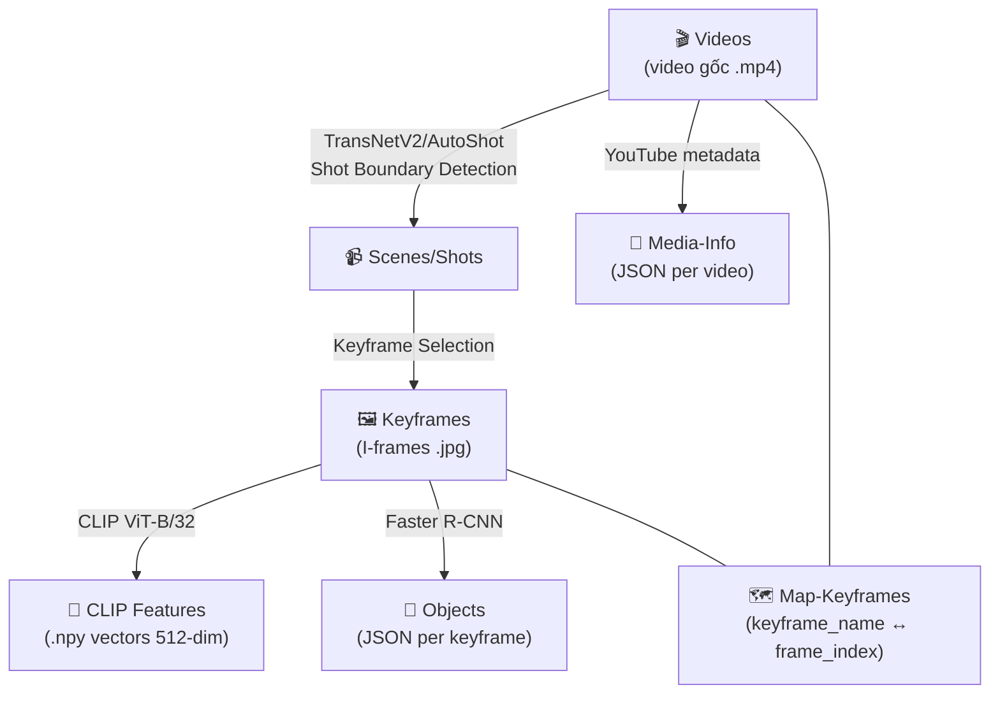
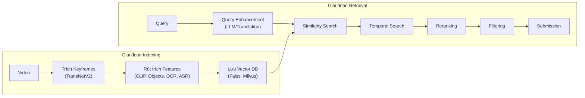
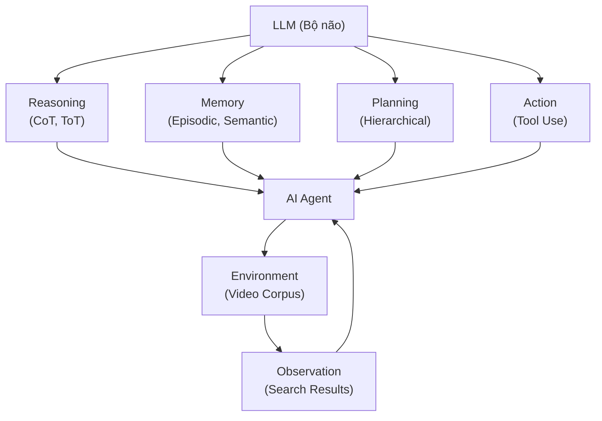

# 📚 AIC 2026 - Tài Liệu Tham Khảo Toàn Diện

> Trích xuất từ toàn bộ dữ liệu `batch_01` và thư mục `docs` trong workspace `d:\AIC 2026`

---

## 1. TỔNG QUAN DỮ LIỆU BATCH_01

### 1.1. Cấu trúc tổng thể

Batch 01 chứa **32 file ZIP** (~110 GB), chia thành **5 nhóm dữ liệu**:

| Nhóm | Mô tả | Số file | Tổng dung lượng (ước tính) |
|------|--------|---------|----------------------------|
| **Videos** | Video gốc từ YouTube | 14 file | ~80 GB |
| **Keyframes** | Keyframes trích từ video | 14 file | ~27 GB |
| **CLIP Features** | Feature vectors CLIP ViT-B/32 | 1 file | ~160 MB |
| **Map-Keyframes** | Metadata mapping keyframe ↔ frame index | 1 file | ~1.5 MB |
| **Media-Info** | Metadata video từ YouTube | 1 file | ~1.1 MB |
| **Objects** | Object detection (Faster R-CNN) | 1 file | ~610 MB |

---

### 1.2. Chi tiết từng file

#### 🎬 Videos (14 file)
Chứa video gốc đã download từ YouTube. Đây là **dữ liệu thi chính thức**.

| File | Dung lượng |
|------|-----------|
| `Videos_L21_a.zip` | 3.1 GB |
| `Videos_L22_a.zip` | 3.9 GB |
| `Videos_L23_a.zip` | 1.9 GB |
| `Videos_L24_a.zip` | 5.4 GB |
| `Videos_L25_a.zip` | 12.0 GB |
| `Videos_L26_a.zip` | 6.1 GB |
| `Videos_L26_b.zip` | 6.4 GB |
| `Videos_L26_c.zip` | 6.4 GB |
| `Videos_L26_d.zip` | 6.3 GB |
| `Videos_L26_e.zip` | 6.5 GB |
| `Videos_L27_a.zip` | 2.4 GB |
| `Videos_L28_a.zip` | 6.8 GB |
| `Videos_L29_a.zip` | 6.3 GB |
| `Videos_L30_a.zip` | 3.9 GB |

> **Quy ước đặt tên**: `Videos_L{XX}_{part}.zip` — `L{XX}` là nhóm/kênh video, `{part}` là phần phân chia (a, b, c, d, e cho bộ L26 lớn)

#### 🖼️ Keyframes (14 file)

| File | Dung lượng |
|------|-----------|
| `Keyframes_L21.zip` | 1.3 GB |
| `Keyframes_L22.zip` | 1.6 GB |
| `Keyframes_L23.zip` | 483 MB |
| `Keyframes_L24.zip` | 1.6 GB |
| `Keyframes_L25.zip` | 5.7 GB |
| `Keyframes_L26_a.zip` | 2.1 GB |
| `Keyframes_L26_b.zip` | 2.3 GB |
| `Keyframes_L26_c.zip` | 2.3 GB |
| `Keyframes_L26_d.zip` | 2.3 GB |
| `Keyframes_L26_e.zip` | 2.3 GB |
| `Keyframes_L27.zip` | 1.0 GB |
| `Keyframes_L28.zip` | 2.0 GB |
| `Keyframes_L29.zip` | 2.3 GB |
| `Keyframes_L30.zip` | 1.3 GB |

> Keyframe = I-frame (khung hình đầy đủ) trong video. Mỗi video có thư mục riêng chứa keyframes. Tên keyframe tăng dần (VD: `0000.jpg`, `0001.jpg`...).

#### 🔢 CLIP Features
- **File**: `clip-features-32-aic25-b1.zip` (~160 MB)
- **Mô hình**: `clip-ViT-B-32`
- **Định dạng**: File `.npy` chứa vector features (512-dim) của tất cả keyframes
- **Thứ tự**: Tăng dần theo chỉ số keyframe

#### 🗺️ Map-Keyframes
- **File**: `map-keyframes-aic25-b1.zip` (~1.5 MB)
- **Nội dung**: Mapping giữa tên file keyframe và frame index thực trong video gốc

#### 📄 Media-Info (Metadata)
- **File**: `media-info-aic25-b1.zip` (~1.1 MB)
- **Nội dung**: Metadata từ YouTube cho mỗi video
- **Định dạng**: File JSON cho mỗi video (VD: `L01_V001.json`)
- **Trường dữ liệu**: `author`, `channel_id`, `channel_url`, `description`, `keywords`, `length`, `publish_date`, `thumbnail_url`, `title`, `watch_url`
- **Lưu ý**: Một số video có thể KHÔNG có file metadata tương ứng

#### 🎯 Objects (Object Detection)
- **File**: `objects-aic25-b1.zip` (~610 MB)
- **Mô hình**: Faster R-CNN + InceptionResNetV2 (pretrained trên Open Images V4)
- **Nội dung**: File JSON cho mỗi keyframe, liệt kê tối đa **100 objects** thuộc **600 categories**
- **Đặt tên**: Tương ứng keyframe (VD: `L01_V001/0000.json` ↔ `L01_V001/0000.jpg`)

---

### 1.3. Mối quan hệ giữa các file



**Luồng dữ liệu chính:**
1. **Video** → Trích xuất **Keyframes** (qua Shot Boundary Detection)
2. **Keyframes** → Rút trích **CLIP Features** (vector embedding 512 chiều)
3. **Keyframes** → Phát hiện **Objects** (bounding boxes, labels, scores)
4. **Map-Keyframes** liên kết tên file keyframe với **frame index** trong video gốc
5. **Media-Info** cung cấp thông tin ngữ cảnh (tiêu đề, mô tả, từ khóa) từ YouTube

> [!IMPORTANT]
> **Dữ liệu thi chính thức là Video.** Các thành phần còn lại (Keyframes, Objects, CLIP Features, Metadata) chỉ nhằm hỗ trợ xây dựng giải pháp. Đây cũng là dữ liệu batch 1 của AIC 2025 — batch 2 sẽ được cung cấp thêm.

---

## 2. NỘI DUNG CÁC TRUY VẤN CUỘC THI

### 2.1. Textual KIS (Known-Item Search)
- **Mục tiêu**: Tìm chính xác đoạn video chứa sự kiện được mô tả bằng văn bản
- **Input**: Mô tả ngôn ngữ tự nhiên về sự kiện
- **Output**: `<video_id>, <frame_id>`
- **Điều kiện đúng**: Video khớp **VÀ** frame_id nằm trong khoảng đáp án `[s, e]`
- **R-Score**: `I(v_i = GT_v ∧ id_i ∈ [s, e])` → 0 hoặc 1

### 2.2. Q&A (Visual Question Answering)
- **Mục tiêu**: Tìm sự kiện VÀ trả lời câu hỏi liên quan
- **Input**: Mô tả sự kiện + câu hỏi
- **Output**: `<video_id>, <frame_id>, <answer>`
- **Điều kiện đúng**: Video khớp **VÀ** frame đúng **VÀ** answer khớp ngữ nghĩa
- **R-Score**: `I(v_i = GT_v ∧ id_i ∈ [s, e] ∧ a_i = GT_a)` → 0 hoặc 1

### 2.3. TRAKE (Temporal Retrieval and Alignment of Key Events)
- **Mục tiêu**: Tìm video + căn chỉnh chính xác N khoảnh khắc ngữ nghĩa
- **Input**: Mô tả chuỗi sự kiện có cấu trúc (N events)
- **Output**: `<video_id>, <frame_id₁>, ..., <frame_idₙ>`
- **Giai đoạn 1 – Retrieval**: Tìm video chứa chuỗi sự kiện
- **Giai đoạn 2 – Alignment**: Xác định keyframe cho mỗi event
- **R-Score**: `(1/N) × Σ I(id_{i,j} ∈ [s_j, e_j])` nếu đúng video, 0 nếu sai video
- **Lưu ý**: Đoạn đáp án thường rất ngắn (< 10 frames)

---

## 3. PHƯƠNG PHÁP ĐÁNH GIÁ

### 3.1. R-Score (Điểm Tương Quan)
- Thang 0–1, đánh giá độ chính xác mỗi câu trả lời
- Khác nhau cho mỗi loại truy vấn (xem mục 2)

### 3.2. Final Score (Điểm Cuối Cùng)
- Mỗi truy vấn: nộp tối đa **100 câu trả lời**
- Với mỗi ngưỡng `k ∈ {1, 5, 20, 50, 100}`:
  - `R@k = max_{1≤i≤k} R-Score(r_i)` (R-Score cao nhất trong top k)
- **Final Score** = trung bình 5 giá trị R@k:

```
Final Score = (R@1 + R@5 + R@20 + R@50 + R@100) / 5
```

> [!TIP]
> Cách tính khuyến khích: **không chỉ tìm đúng mà còn phải xếp câu đúng ở vị trí đầu** trong danh sách!

---

## 4. KIẾN TRÚC HỆ THỐNG VIDEO RETRIEVAL

### 4.1. Tổng quan Pipeline



### 4.2. Giai đoạn Indexing (Tiền xử lý)

#### A. Video → Scenes (Shot Boundary Detection)
- **TransNet V2**: Deep network kiến trúc cho fast shot transition detection
- **AutoShot**: Short video dataset + SOTA shot boundary detection
- Video được chia thành các Moment Scenes

#### B. Scenes → Keyframes (Keyframe Selection)
- **Mục tiêu**: Giữ lại ít frame nhất mà vẫn bảo toàn thông tin
- **Phương pháp**: Loại bỏ frames có inter-frame variation thấp (cosine similarity > threshold)
- **Ràng buộc bổ sung**: Number of objects, Color, Location
- **Lưu ý**: Keyframe selection ảnh hưởng trực tiếp đến kết quả retrieval

```python
# Keyframe filtering pseudocode
def filtering_function(scenes, threshold):
    for scene in scenes:
        for idx, frame in enumerate(scene):
            if idx == 0:
                continue
            similarity = cosine(scene[idx-1], scene[idx])
            if similarity >= threshold:
                remove(frame)
```

#### C. Feature Extraction
| Loại | Model/Tool | Mục đích |
|------|-----------|----------|
| **Visual Embedding** | CLIP (ViT-B/32, ViT-L/14), BEiT3, BLIP/BLIP2, SigLIP, InternVL | Tìm kiếm theo text/image |
| **Object Detection** | Faster R-CNN (OpenImages V4), YOLOv10/v13, Co-DETR, DINO | Lọc theo số lượng/vị trí object |
| **OCR** | MMOCR, VietOCR, DeepSolo++, ParseQ, Gemini API | Tìm kiếm text trong ảnh |
| **ASR** | Whisper, etc. | Tìm kiếm qua audio/transcript |
| **Gender/Age** | MiVOLO | Lọc theo giới tính/tuổi |
| **Captioning** | BLIP-2, Gemini API | Mô tả ảnh bằng text |

#### D. Vector Database
- **Khuyến nghị**: Faiss (phổ biến nhất trong cuộc thi)
- **Alternatives**: Milvus, Pinecone, Weaviate, Chroma, Qdrant, LanceDB
- **So sánh**: https://superlinked.com/vector-db-comparison

---

### 4.3. Giai đoạn Retrieval (Truy vấn)

#### A. Query Enhancement
- **Translation** (Vi → En): M2M100, NLLB-200, Google Translate API, Gemini API
- **Query Expansion**: Dùng LLM mở rộng truy vấn thành nhiều kịch bản chi tiết
- **Query Rewriting**: Viết lại query dựa trên vocab/labels của model
- **Term Substitution**: Thay thế từ bằng synonyms

> [!TIP]
> Hầu hết SOTA embedding models hỗ trợ tiếng Anh. Cần dịch query tiếng Việt sang tiếng Anh trước khi search.

#### B. Temporal Search
- **Mục đích**: Tìm chuỗi sự kiện theo thứ tự thời gian
- **Ý tưởng**: Phân tách query phức tạp thành Q1, Q2, ... rồi tìm chuỗi frames match theo thứ tự

```python
# Temporal search pseudocode
topk_frame = search(Q)
for frame_idx in topk_frame:
    Q1, Q2 = decompose_query(Q)
    all_frames = get_frames_belong_to_same_video(frame_idx)
    prediction = temporal_search(all_frames, Q1, Q2)

# Scoring
score = similarity(Q1, F_i) + max(similarity(Q2, F_{i+1:i+T}))
```

##### Adaptive Temporal Search (CVPRW 2025)
- Cân bằng giữa **Exploitation** (tốc độ) và **Exploration** (tìm thêm candidates)
- Sử dụng cơ chế **tolerance threshold**

```python
# Adaptive temporal search
tolerance = 0
best = 0
threshold = 3
for idx in range(current_idx+1, end_idx):
    similarity = cosine(current_kf, kfs[idx])
    if best < similarity:
        best = similarity
        tolerance = 0
    else:
        tolerance += 1
    if tolerance == threshold:
        return
```

#### C. Reranking

| Phương pháp | Ưu điểm | Nhược điểm |
|------------|----------|------------|
| **Additional Constraints** (OD, OCR) | Trực quan, dễ implement | Khó tổng quát, khó quyết định khi nào dùng |
| **MLLM Reranking** | Semantic alignment mạnh | Tốn tài nguyên, latency cao |
| **Cross-Encoder** | Chính xác cao | Re-execute model mỗi lần |
| **Cross-Modal Region-Phrase** | Match local patches ↔ phrases | Phức tạp |
| **SuperGlobal Reranking** ⭐ | Không cần model phụ, resource-friendly | - |

##### SuperGlobal Reranking (CVPRW 2025)
- Chỉ dùng global features, **không cần model phụ**
- Bước 1: Top-K nearest neighbors làm refinement candidates
- Bước 2: Feature refinement qua GeM pooling
- Bước 3: Reranking bằng refined representations

```python
S1 = cosine(r_o_image, r_r_text)
S2 = cosine(r_o_text, r_r_image)
S_final = 0.5 * (S1 + S2)
# Sort theo S_final giảm dần
```

#### D. Conversational Chat / User Feedback
- **Relevance Feedback**: User đánh dấu related/unrelated → điều chỉnh embedding
- **Exploration** (khám phá): Hiển thị kết quả ít liên quan để mở rộng phạm vi
- **Exploitation** (khai phá): Hiển thị kết quả liên quan cao để phân biệt

```
f_eval = cs(q, f) + α × Σ cs(r_f, f) - β × Σ cs(r_nf, f)
```

#### E. Ensemble Search
- Kết hợp nhiều model (CLIP + BEiT3 + ...) → Ensemble scoring

#### F. Filtering Mechanism
- Lọc kết quả bằng metadata đã trích xuất: OD Location, Quantity, Color, ASR, OCR

---

### 4.4. Pipeline cho từng loại Task

#### Textual KIS Pipeline
```
Query → Query Enhancement → Search → Filtering → Reranking → Temporal Search → Submission
```

#### VQA Pipeline
```
Query → Search → Reranked TopK → Shot Validation → Frame/Shot Input → Agent → Answer → Submission
```

**VQA Agent Workflow:**
1. **Shot Validation**: Chọn ground truth shot (không phải lúc nào top-1 cũng đúng)
   - Baseline: Group frames → Average → Sort
   - Advanced: MLLM confidence scoring
2. **Shot Summary**: CoT Summary Prompting qua MLLM
3. **Agent** (ReAct pattern):
   - Thought → Action → Tool → Observation → ...
   - Sử dụng Planning: "By analyzing existing info, create retrieval plan..."
   - Tools: OCR, OD, Temporal, Similarity Search...

#### TRAKE Pipeline
```
Query → N events decomposition → Search → Temporal Search → Filtering → Reranking → Submission
```

---

## 5. EMBEDDING MODELS

### 5.1. Phân loại kiến trúc

| Kiến trúc | Mô tả | Ưu điểm | Nhược điểm | Khi nào dùng |
|-----------|--------|---------|------------|--------------|
| **Late-fusion** | Rút trích feature độc lập (ảnh, text) | Tiết kiệm thời gian retrieval | Phụ thuộc hoàn toàn vào model | Truy vấn trên dữ liệu lớn |
| **Early-fusion** | Thông tin ảnh và text bổ trợ nhau | Tăng tính lý giải, visual grounding | Phải chạy lại toàn bộ model mỗi query | Số lượng data thấp, bước cuối cùng |

### 5.2. Các model tiêu biểu

| Model | Kiến trúc | Ghi chú |
|-------|-----------|---------|
| CLIP (OpenAI) | Late-fusion | Chuẩn baseline, zero-shot learning |
| BEiT3 | Late-fusion | Kết quả tốt, cần code riêng |
| BLIP / BLIP2 | Late-fusion | Captioning + Retrieval |
| SigLIP | Late-fusion | Sigmoid loss thay vì softmax |
| InternVL | Late-fusion | Vision-Language mạnh |
| OWL-ViT | Late-fusion | Object detection zero-shot |
| GLIP | Early-fusion | Visual grounding |
| UNINEXT | Early-fusion | Unified framework |

> [!TIP]
> **Prompt Engineering**: Zero-shot performance có thể cải thiện đáng kể bằng cách customize prompt text cho mỗi task. (Alec Radford et al.)

---

## 6. AI AGENT CHO VIDEO RETRIEVAL

### 6.1. Kiến trúc AI Agent



### 6.2. Các thành phần

| Thành phần | Mô tả |
|------------|--------|
| **Reasoning** | IO → CoT → ToT (tăng dần complexity). System 1 (fast) vs System 2 (slow reasoning) |
| **Memory** | Episodic (trải nghiệm), Semantic (kiến thức), Procedural (kỹ năng). HippoRAG cho long-term memory |
| **Planning** | Single-step (greedy) → Tree search → World model. Cân bằng exploration/exploitation |
| **Action Space** | Internal actions, Self-reflection, Tool calls, Multimodal perception |

### 6.3. Ứng dụng trong cuộc thi

#### VideoQA Agent
- **Agent**: LLM Planner (GPT-4o)
- **Khung**: STAR (Spatiotemporal Reasoning)
- **Tools**: Thời gian (cắt đoạn, chọn keyframe) + Không gian (OD, OCR, zoom)

#### Lifelog Retrieval Agent
- **Agent**: Conversational Search + RAG
- **Storage**: CLIP/BLIP-2 vectors + Elasticsearch
- **Feedback**: Tính lại vector trọng số từ user feedback, Reranking → Reader → Answer

---

## 7. TECH STACK KHUYẾN NGHỊ

### 7.1. Backend
- **Framework**: FastAPI (Python)
  - Core: Application Object → Path Operations → Dependencies → Data Validation
  - Background Tasks, Event Handlers (Lifespan)

### 7.2. Frontend
- Video Browser UI (hiển thị kết quả, temporal view)

### 7.3. Infrastructure
- **Vector DB**: Faiss (search bằng CPU hoặc GPU)
- **Storage**: Cần ~300GB cho toàn bộ data (AIC 2024 reference)

---

## 8. CHIẾN THUẬT THI ĐẤU

### 8.1. Phân chia vai trò
- Mỗi thành viên phụ trách một **phương pháp search** hoặc **phần không gian tìm kiếm** cụ thể
- Cần ít nhất 1 thành viên là **Software Developer**
- Phân công phải được thống nhất trước, tránh trùng lặp

### 8.2. Kỹ năng cần thiết
- **Tốc độ gõ phím** (typing speed) quan trọng
- **Textual Query Writing**: Mô tả đủ chi tiết nhưng ngắn gọn, giảm search space
- Câu query dài hơn → kết quả tốt hơn NHƯNG tốn thời gian xử lý hơn

### 8.3. Chiến lược tối ưu
1. Thu hẹp dần phạm vi: Thời gian → Địa điểm → Đối tượng → Cảnh vật
2. Kết hợp nhiều cách search → giảm search space NHƯNG cẩn thận loại bỏ ground truth
3. Khi bí:
   - Tập trung vào **đặc điểm phân biệt** (distinguishing features)
   - Một người **explore** (mở rộng), người khác **exploit** (tập trung)
4. Dựa trên những gì **chắc chắn quan sát được** để viết query
5. Tận dụng synonym, thử nhiều cách diễn đạt

> [!WARNING]
> Reducing search space có thể khiến ground truth bị loại ra — không thể tìm dù tìm bao lâu!

---

## 9. TÀI LIỆU THAM KHẢO (Papers)

### Từ cuộc thi / Workshops
1. **A Lightweight Moment Retrieval System with Global Re-Ranking and Robust Adaptive Bidirectional Temporal Search** — CVPRw 2025 (Tinh-Anh, Tien-Huy et al.)
2. **Towards Efficient and Robust Moment Retrieval System: A Unified Framework for Multi-Granularity Models and Temporal Reranking** — CVPRw 2025 (Tien-Huy, Tinh-Anh et al.)
3. **LLandMark: A Multi-Agent Framework for Landmark-Aware Multimodal Interactive Video Retrieval** — AAAIw 2026
4. **Unified Interactive Multimodal Moment Retrieval via Cascaded Embedding-Reranking and Temporal-Aware Score Fusion** — AAAIw 2026
5. **Integrated Semantic and Temporal Alignment for Interactive Video Retrieval** — SOICT 2025
6. **MADTempo: An Interactive System for Multi-Event Temporal Video Retrieval with Query Augmentation** — SOICT 2025

### Conferences Proceedings
- SOICT 2023, 2024, 2025
- VBS (Video Browser Showdown) Proceedings
- TRECVid Proceedings

### AI Agent
- HippoRAG (NeurIPS 2024) — Long-term memory cho LLM
- Mind2Web (NeurIPS 2024) — Web Agent generalist
- EMNLP 2024 Tutorial on Language Agents
- MemoriEase 2.0/3.0 — Conversational Lifelog Retrieval (LSC'24, LSC'25)
- Tool-Augmented Spatiotemporal Reasoning for Video QA

### Embedding Models
- CLIP (OpenAI), BEiT3, BLIP/BLIP2, SigLIP, InternVL
- MiVOLO (Gender/Age Recognition)

### Other Tools
- TurboVec: https://github.com/RyanCodrai/turbovec.git (Vector search)
- Vector DB Comparison: https://superlinked.com/vector-db-comparison

---

## 10. DANH SÁCH TÀI LIỆU GỐC

| # | File | Loại | Trang | Nội dung chính |
|---|------|------|-------|----------------|
| 1 | [Thong tin vong So tuyen AIC2026.pdf](file:///d:/AIC%202026/docs/Thong%20tin%20vong%20So%20tuyen%20AIC2026.pdf) | Quy định cuộc thi | 6 | Nội dung truy vấn, cách tính điểm, dữ liệu |
| 2 | [Tập huấn AIC 2026 - Buổi 1.pptx.pdf](file:///d:/AIC%202026/docs/T%E1%BA%ADp%20hu%E1%BA%A5n%20AIC%202026%20-%20Bu%E1%BB%95i%201.pptx.pdf) | Slide tập huấn BTC | 50 | Tổng quan bài toán, CLIP, AI Agent, Indexing/Retrieval, Dữ liệu, Case studies |
| 3 | [Tập huấn AIC 2026 - Buổi 2.pdf](file:///d:/AIC%202026/docs/T%E1%BA%ADp%20hu%E1%BA%A5n%20AIC%202026%20-%20Bu%E1%BB%95i%202.pdf) | Slide tập huấn BTC | 45 | VLM models (Early/Late fusion), Prompt Engineering, Ensembling |
| 4 | [Tập huấn AIC 2026 - Buổi 3.pdf](file:///d:/AIC%202026/docs/T%E1%BA%ADp%20hu%E1%BA%A5n%20AIC%202026%20-%20Bu%E1%BB%95i%203.pdf) | Slide tập huấn BTC | 39 | AI Agent (LLM, Reasoning, Memory, Planning), Ứng dụng thực tế |
| 5 | [Documents_2026-5 - Buổi training cho AIC_HCMAI2026.pdf](file:///d:/AIC%202026/docs/Documents_2026-5_M01W04%20-%20Bu%E1%BB%95i%20training%20cho%20AIC_HCMAI2026.pdf) | Slide training AIO | 24 | Techniques, References, Advice |
| 6 | [HCMC AI Challenge (Buổi 1) - Slide v2.pdf](file:///d:/AIC%202026/docs/HCMC%20AI%20Challenge%20(Bu%E1%BB%95i%201)_%5BSlide_v2%5D-HCMC_AI_2025.pdf) | Slide AIO 2025 | 123 | SBD, Keyframe Selection, Temporal Search, Embedding, OCR, OD, Pipeline, FastAPI |
| 7 | [HCMC AI Challenge (Buổi 2) - v4.pdf](file:///d:/AIC%202026/docs/HCMC%20AI%20Challenge%20(Bu%E1%BB%95i%202)-v4.pdf) | Slide AIO 2025 | 159 | Keyframe Selection, Temporal Search, Reranking, VQA Agent, Conversational Chat, Strategy |
| 8 | [HCMC AI Challenge (Buổi 3) - Slide.pdf](file:///d:/AIC%202026/docs/HCMC%20AI%20Challenge%20(Bu%E1%BB%95i%203)_%5BSlide%5D-HCMCAI_Part3.pdf) | Slide AIO 2025 | 129 | Pipeline chi tiết, Evaluation Metric, QA (89 câu hỏi thường gặp) |

### Ảnh tham khảo
| File | Nội dung |
|------|----------|
| [ref_01.png](file:///d:/AIC%202026/docs/ref_01.png) | Vector Database landscape — Choosing a Vector Database (RAG/Retriever) |
| [ref_02.png](file:///d:/AIC%202026/docs/ref_02.png) | CLIP Feature Space — Image Encoder + Text Encoder → 512-dim embedding |

---

## 11. BA THÁCH THỨC CỐT LÕI

1. **Khoảng cách ngữ nghĩa (Semantic Gap)**: Chênh lệch giữa ngôn ngữ trừu tượng và pixel thô → Cần Foundation Models mạnh
2. **Dữ liệu thưa + Quy mô lớn (Data Sparsity)**: Khoảnh khắc cần tìm ~2-3 giây trong hàng nghìn giờ video → Cần bộ lọc thô cực nhanh
3. **Ràng buộc logic thời gian (Temporal Logic)**: Trật tự trước-sau của hành động → Cần Temporal Search

---

## 12. HƯỚNG PHÁT TRIỂN TƯƠNG LAI

| Hướng | Chi tiết |
|-------|----------|
| **Advanced Planning** | Hierarchical planning, Tree search, Value functions |
| **Data Synthesis** | Tổng hợp dữ liệu với LLMs, khám phá "quá trình ẩn" |
| **Continuous Learning** | Chuyển từ behavior cloning sang exploration + trial-and-error |
| **AI Safety** | Hành động không thể đảo ngược, ảo giác, quyền riêng tư |
| **Agent-Computer Interface** | ACI lấy cảm hứng từ HCI, Human-AI collaboration |
| **LVLM & Generative AI** | Gemini, GPT-4o — "lý luận" về hình ảnh, không chỉ "so khớp" |
| **Smart Interaction** | Trợ lý đặt câu hỏi ngược để làm rõ ý định (Interactive Search) |
