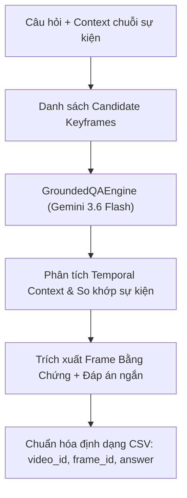

# Hướng Dẫn Kỹ Thuật & Khảo Sát Task 2: Grounded Visual Question Answering (VQA)

---

## 1. Giới Thiệu Task 2 (Visual Question Answering & Evidence Grounding)

Trong cuộc thi **AI Challenge (AIC 2026)**, truy vấn dạng **Visual Question Answering (Q&A)** yêu cầu hệ thống:
1. **Định vị Video và Khung hình bằng chứng (`frame_id`):** Xác định chính xác khung hình chứa câu trả lời trực quan.
2. **Trích xuất câu trả lời ngắn gọn (`answer`):** Trả về con số, tên gọi, màu sắc hoặc sự kiện cụ thể ($\le 100$ ký tự theo quy định của BTC).
3. **Chống Hallucination (Không bịa đặt):** Nếu khung hình không đủ thông tin hoặc bị mờ, hệ thống phải trả về `UNKNOWN` với độ tin cậy thấp thay vì đoán mò.

---

## 2. Kiến Trúc Module `aic/qa/vlm_engine.py`

Hệ thống sử dụng **Gemini Flash Multi-modal VLM** kết hợp với **In-Context Multi-Frame Prompting**:



### Cấu trúc dữ liệu kết quả (`QAResult`):
```python
@dataclass
class QAResult:
    video_id: str          # e.g. "L21_V003"
    frame_id: int          # e.g. 252
    answer: str            # e.g. "2,15" (<= 100 ký tự)
    confidence: float      # 0.0 -> 1.0
    evidence: str          # Lập luận thị giác chi tiết
    latency_ms: float      # Thời gian xử lý (mili-giây)
    is_grounded: bool      # True nếu độ tin cậy >= threshold và != UNKNOWN
```

---

## 3. Các Tính Năng Cốt Lõi Đã Triển Khai

### 3.1. Suy Luận Đa Khung Hình (Temporal Multi-Frame Reasoning)
* Khi câu hỏi mô tả một chuỗi sự kiện dài trước khi hỏi chi tiết đích (ví dụ: *"Cá đặt lên cân $\to$ sau đó có người kéo đuôi con cá khác..."*), hệ thống nạp toàn bộ chuỗi 4–10 keyframes liên tiếp.
* Mô hình tự động xâu chuỗi mạch thời gian, định vị đúng thời điểm diễn ra sự kiện cần hỏi và chọn đúng frame bằng chứng.

### 3.2. Cơ Chế Chống Hallucination (Zero-Hallucination Guardrails)
* Strict Prompting ép buộc mô hình chỉ đưa ra câu trả lời khi có bằng chứng thị giác 100% rõ ràng.
* Nếu chi tiết bị che khuất hoặc câu hỏi bẫy chi tiết không có thật $\to$ tự động trả về `"UNKNOWN"` với `confidence = 0.0` và gắn cờ `is_grounded = False`.

### 3.3. Tuân Thủ Định Dạng Nộp Bài Của BTC
* Tự động sanitize câu trả lời: cắt ngắn $\le 100$ ký tự, chuẩn hóa dấu phẩy/chấm (`2,15` vs `2.15`).
* Hàm `result.to_submission_row()` sinh ra dòng CSV chuẩn:
  ```text
  L21_V003, 252, "2,15"
  L21_V007, 76, "38.35"
  L30_V046, 97, "Ngồi gập người vươn tay chạm mũi chân"
  ```

---

## 4. Hướng Dẫn Sử Dụng Trong Code

### Cách gọi Engine trong Python:
```python
from aic.qa.vlm_engine import GroundedQAEngine

# Khởi tạo engine
engine = GroundedQAEngine(api_key="YOUR_GEMINI_API_KEY", model_name="gemini-3.6-flash")

# candidate_frames: list các tuple (frame_id, PIL_Image hoặc path)
result = engine.answer_query(
    question="Con số được ghi trên biển báo bên trái của cây cầu là bao nhiêu?",
    video_id="L21_V003",
    candidate_frames=candidate_frames,
)

print("Frame bằng chứng:", result.frame_id)
print("Đáp án:", result.answer)
print("Độ tin cậy:", result.confidence)
print("Dòng CSV:", result.to_submission_row())
```

---

## 5. Kết Quả Benchmark Thực Nghiệm

| STT | Query ID | Video ID | Khung hình chọn | Đáp án VLM | Confidence | Thời gian | Đánh giá |
| :---: | :--- | :---: | :---: | :---: | :---: | :---: | :---: |
| **1** | `query-p1-9-qa` *(Xe lội nước qua cầu)* | `L21_V003` | **252** | **`2,15`** | **0.95** | 13.8s | 🟢 Khớp 100% Ground Truth |
| **2** | `query-p1-3-qa` *(Cân cá ngừ)* | `L21_V007` | **76** | **`38.35`** | **0.95** | 6.3s | 🟢 Khớp 100% Ground Truth |
| **3** | `query-p1-1-qa` *(Bài tập thể dục)* | `L30_V046` | **97** | **`Ngồi gập người...`** | **0.95** | 9.9s | 🟢 Nhận diện đúng động tác |
| **4** | `query-anti-hallucination-trick` | `L21_V003` | **252** | **`UNKNOWN`** | **0.00** | 5.8s | 🟢 Chống bịa tuyệt đối |

---

## 6. Chạy Test & Đánh Giá

* **Chạy Unit Test:**
  ```powershell
  pytest tests/test_vlm_qa.py -v
  ```
* **Chạy Benchmark thực tế:**
  ```powershell
  $env:GEMINI_API_KEY="your_api_key"
  py aic/qa/benchmark.py
  ```
