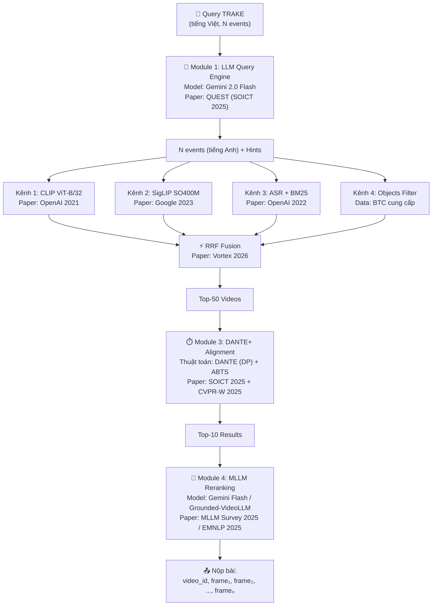

# 🔧 Tổng Hợp Models & Thuật Toán — Pipeline TRAKE AIC 2026

---

## 1. Tất Cả Models AI Trong Pipeline

| # | Model | Kích thước | Chạy ở đâu | Chức năng cụ thể | Paper gốc |
|---|-------|-----------|-----------|-------------------|-----------|
| 1 | **Gemini 2.0 Flash** | API (0 GB local) | Google Cloud (miễn phí) | Nhận query tiếng Việt dài → Tự động tách thành N events riêng biệt, dịch sang tiếng Anh, sinh danh sách vật thể/hành động kỳ vọng (hints). Ngoài ra dùng để nhìn ảnh keyframe và chấm điểm lại Top-10 kết quả cuối cùng (reranking). | Google 2024 |
| 2 | **CLIP ViT-B/32** | ~400MB VRAM | Colab T4 | Biến một câu text thành vector 512 chiều để so sánh với vector của keyframes (đã được BTC tính sẵn). Là kênh search chính (baseline) — nhập text, nhả ra danh sách keyframes giống nhất. | *"Learning Transferable Visual Models From Natural Language Supervision"* — OpenAI, ICML 2021 |
| 3 | **SigLIP SO400M** | ~1.2GB VRAM | Colab T4 | Chức năng giống CLIP nhưng **chất lượng cao hơn** nhờ dùng hàm loss Sigmoid thay vì Softmax. Là kênh search thứ 2 — kết quả chính xác hơn CLIP, đặc biệt với chi tiết nhỏ (màu sắc, chữ viết). Cần tự tính features cho toàn bộ keyframes trước khi thi. | *"Sigmoid Loss for Language Image Pre-Training"* — Google, ICCV 2023 |
| 4 | **Faster-Whisper large-v3** | ~3GB VRAM | Colab T4 | Nghe âm thanh trong video → Chuyển thành văn bản (transcript) kèm timestamp chính xác (giây bắt đầu, giây kết thúc). Dùng để tìm video có chứa lời nói cụ thể (tên người, địa danh, câu thoại). Đã và đang chạy trên Colab. | *"Robust Speech Recognition via Large-Scale Weak Supervision"* — OpenAI 2022 (Whisper gốc). Faster-Whisper là bản tối ưu bởi cộng đồng. |
| 5 | **Faster R-CNN + InceptionResNetV2** | BTC tính sẵn | — (không cần chạy) | Quét từng keyframe và liệt kê tối đa 100 vật thể có trong ảnh (người, xe, bàn, ghế...) kèm vị trí (bounding box) và độ tự tin. Dùng để lọc: nếu query nói "3 người" nhưng keyframe chỉ có 1 người → loại. | Pretrained trên **Open Images V4** (600 categories). BTC đã cung cấp sẵn trong file `objects-aic25-b1.zip`. |
| 6 | **Grounded-VideoLLM** | ~5GB (INT8) | Colab T4 | Nhận ảnh keyframe + câu hỏi → Trả lời chính xác "ảnh này có khớp với mô tả không?" kèm timestamp. Dùng làm phương án backup cho reranking nếu Gemini API bị giới hạn. Hiểu thời gian tốt hơn các model khác nhờ kiến trúc Two-Stream + Discrete Temporal Tokens. | *"Grounded-VideoLLM"* — EMNLP 2025 Findings. GitHub: [WHB139426/Grounded-Video-LLM](https://github.com/WHB139426/Grounded-Video-LLM). Base: Phi-3.5-Vision (~4B params). |

---

## 2. Tất Cả Thuật Toán (Không Phải Model AI)

| # | Thuật toán | Chức năng cụ thể | Paper gốc |
|---|-----------|-------------------|-----------|
| 7 | **DANTE** (Dynamic Programming) | Nhận vào: danh sách keyframes của 1 video + N event queries. Dùng quy hoạch động để gán mỗi event vào 1 keyframe sao cho: (a) tổng điểm similarity cao nhất, (b) thứ tự thời gian được đảm bảo (frame event 1 < frame event 2 < ...). Độ phức tạp O(K×N) thay vì O(K^N). | *"Integrated Semantic and Temporal Alignment for Interactive Video Retrieval"* — SOICT 2025, [arXiv:2512.13169](https://arxiv.org/abs/2512.13169). Đội AIO_Owlgorithms (AIC 2025). |
| 8 | **ABTS** (Adaptive Bidirectional Temporal Search) | Sau khi DANTE chọn xong N frames, ABTS dò quanh mỗi frame ±10 positions (cả trước lẫn sau) để tìm frame chính xác hơn. Có cơ chế "tolerance": nếu dò 3 frames liên tiếp mà không tìm được frame tốt hơn → dừng lại, không tốn thời gian. | *"A Lightweight Moment Retrieval System with Global Re-Ranking and Robust Adaptive Bidirectional Temporal Search"* — CVPR Workshop IViSE 2025. |
| 9 | **RRF** (Reciprocal Rank Fusion) | Nhận vào: 4 danh sách xếp hạng (từ CLIP, SigLIP, ASR, Objects). Gộp thành 1 danh sách duy nhất bằng công thức: mỗi item ở vị trí rank r nhận điểm 1/(k+r). Video nào xuất hiện ở TOP của nhiều danh sách → tổng điểm cao → được ưu tiên. | Hệ thống **Vortex** (2026) áp dụng. Paper gốc: *"Reciprocal Rank Fusion outperforms Condorcet and individual Rank Learning Methods"* — Cormack et al. 2009. |
| 10 | **Faiss** (Facebook AI Similarity Search) | Thư viện tìm kiếm vector. Nhận vào: 1 vector query (512 chiều) + database chứa hàng triệu vectors. Trả về: Top-K vectors gần nhất trong < 0.1 giây. Dùng thuật toán Inner Product hoặc L2 distance. | Facebook AI Research. Tài liệu BTC khuyến nghị dùng. |
| 11 | **BM25** (Best Matching 25) | Thuật toán tìm kiếm văn bản cổ điển. Nhận vào: 1 câu query + database chứa transcript (JSON từ ASR). Trả về: Top-K transcript có chứa từ khóa khớp nhất, có tính trọng số TF-IDF (từ hiếm thì quan trọng hơn từ phổ biến). | Thuật toán cổ điển (Robertson et al. 1995). Dùng thư viện `rank_bm25` trong Python. |

---

## 3. Chi Tiết Từng Module

### Module 1: LLM Query Engine

| Bước | Model/Thuật toán | Chức năng | Nguồn gốc |
|------|-----------------|-----------|-----------|
| Tách query → N events | Gemini 2.0 Flash | Đọc hiểu đoạn văn tiếng Việt, xác định có bao nhiêu sự kiện, tách thành N câu riêng biệt | QUEST (SOICT 2025) |
| Dịch Vi → En | Gemini 2.0 Flash | Dịch mỗi event sang tiếng Anh vì CLIP/SigLIP chỉ hiểu tiếng Anh | Tài liệu BTC Buổi 1 |
| Sinh hints | Gemini 2.0 Flash | Liệt kê vật thể, hành động, bối cảnh kỳ vọng cho mỗi event để dùng làm bộ lọc phụ | Hint-Augmented Reranking (arXiv 2025) + Ý tưởng mới |

### Module 2: Multi-Signal Retrieval

| Bước | Model/Thuật toán | Chức năng | Nguồn gốc |
|------|-----------------|-----------|-----------|
| Kênh 1: CLIP search | CLIP ViT-B/32 + Faiss | Encode text → vector 512d → Tìm Top-100 keyframes có vector gần nhất | OpenAI 2021 + BTC |
| Kênh 2: SigLIP search | SigLIP SO400M + Faiss | Giống kênh 1 nhưng dùng model tốt hơn, trả về Top-100 keyframes chính xác hơn | Google 2023 |
| Kênh 3: ASR search | Faster-Whisper + BM25 | Tìm trong transcript (JSON) xem video nào có lời thoại chứa từ khóa liên quan | OpenAI 2022 + BM25 cổ điển |
| Kênh 4: Object filter | Faster R-CNN (BTC sẵn) | Kiểm tra keyframe có chứa vật thể mà LLM hints liệt kê không. Có → cộng điểm. Không có → trừ điểm | BTC cung cấp sẵn |
| Gộp 4 kênh | RRF | Lấy 4 danh sách Top-100 từ 4 kênh, bỏ phiếu chọn ra Top-50 video được nhiều kênh đồng ý nhất | Vortex 2026 + Cormack 2009 |

### Module 3: DANTE+ Temporal Alignment

| Bước | Model/Thuật toán | Chức năng | Nguồn gốc |
|------|-----------------|-----------|-----------|
| Tính similarity score | CLIP + SigLIP (weighted) | Tính điểm "giống nhau" giữa mỗi event query và mỗi keyframe trong video ứng viên. Dùng cả 2 encoder rồi cộng có trọng số (0.4 CLIP + 0.6 SigLIP) | Vortex 2026 (dual-encoder fusion) |
| Cộng thêm ASR score | BM25 | Nếu keyframe nằm gần đoạn transcript có chứa từ khóa liên quan → cộng thêm điểm | Ý tưởng mới |
| Cộng thêm Object score | Exact match | Nếu keyframe chứa vật thể mà hints liệt kê → cộng thêm điểm | Ý tưởng mới |
| DP Alignment | DANTE | Dùng bảng DP để tìm bộ N frames có tổng multi-modal score cao nhất VÀ đúng thứ tự thời gian | SOICT 2025 |
| Tinh chỉnh | ABTS | Dò quanh ±10 frames mỗi vị trí DANTE đã chọn, tìm frame chính xác hơn | CVPR-W IViSE 2025 |

### Module 4: MLLM Reranking

| Bước | Model/Thuật toán | Chức năng | Nguồn gốc |
|------|-----------------|-----------|-----------|
| Chấm điểm lại (Phương án A) | Gemini 2.0 Flash | Gửi N ảnh keyframe + query gốc cho Gemini. Gemini nhìn ảnh thật, đánh giá mức độ khớp (0-100 điểm). Xếp lại thứ hạng Top-10 dựa trên điểm Gemini | MLLM Survey (arXiv 2025) |
| Chấm điểm lại (Phương án B) | Grounded-VideoLLM | Giống phương án A nhưng chạy model local trên T4 thay vì gọi API. Dùng khi Gemini bị rate limit | EMNLP 2025 |

---

## 4. Lưu Đồ Tổng Hợp

